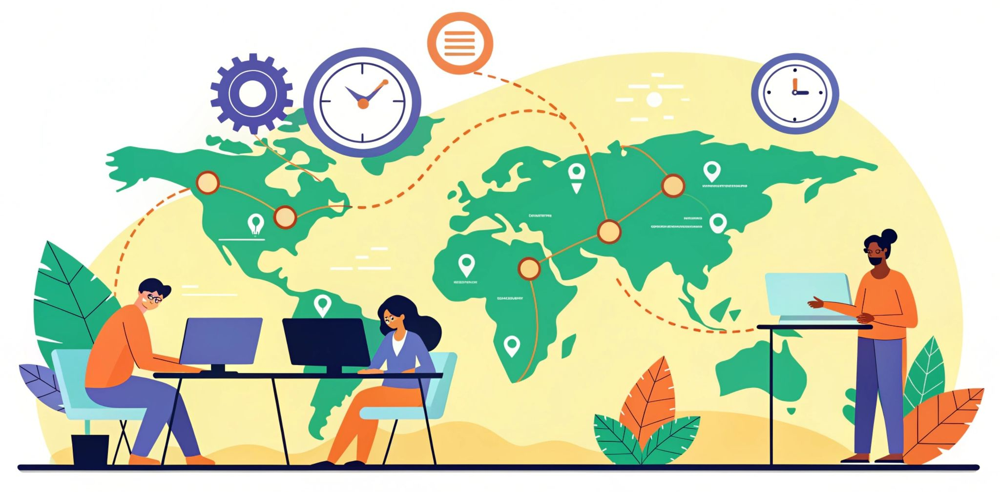

# How to Build an Effective Global Development Team

**Want to build a productive global development team?** Here's what you need to know:

-   **Save Costs**: Hiring international developers can cost less than AUD 60,000 annually and less while maintaining quality.
    
-   **Boost Productivity**: Remote setups improve productivity for 64% of organisations.
    
-   **Leverage Diversity**: Global teams bring fresh ideas and 24/7 work cycles.
    
-   **Key Challenges**: Time zones, communication, and team cohesion need careful planning.
    

**Quick Tips**:

1.  Use tools like [Slack](https://slack.com/intl/en-au), [Zoom](https://www.zoom.com/en/products/virtual-meetings/), and [Google Workspace](https://workspace.google.com/intl/en_au/) for seamless collaboration.
    
2.  Schedule overlapping work hours and rotate meeting times for fairness.
    
3.  Build connections with virtual activities, recognition systems, and shared goals.
    
4.  Stay compliant with local laws and provide proper resources to your team.
    

**Want all the details?** Keep reading for step-by-step strategies and tools to manage your global team effectively.

<!--truncate-->

## Setting Up Your Global Development Team

Building a global development team requires careful planning and execution. Let's break down the key steps.

### Finding International Tech Talent

To hire skilled developers from around the world, it's important to diversify your approach [\[2\]](https://youteam.io/blog/guide-to-hiring-remote-team-of-software-developers/). Here are some effective methods for Australian businesses:

-   **Tech Conference Networking**: Events like [PyCon](https://pycon.org/) and [Java Day](http://javaday.by/en/), now often held virtually, provide direct access to experienced developers and insights into the latest tech trends.
    
-   **Professional Referrals**: Tap into your existing network to find candidates who have already been vetted and are more likely to fit your team's culture.
    
-   **Structured Interview Process**: Stick to a consistent hiring process. Start with a video call to evaluate communication skills and cultural compatibility, follow up with a hands-on coding challenge, and conclude with a discussion about salary expectations and work arrangements.
    

### Setting Clear Team Guidelines

Establishing clear goals and expectations is essential for a productive team. Regular progress updates and detailed documentation can help keep everyone aligned. Consider these key areas:

| Guideline Category | Key Components | Implementation Method |
| --- | --- | --- |
| Work Standards | Code quality, documentation needs | Code reviews, automated testing |
| Communication Protocol | Response times, meeting attendance | Team chats, video conferences |
| Performance Metrics | Sprint goals, delivery timelines | Project management dashboards |

### Managing Time Zone Differences

Time zone challenges can affect productivity, but a structured approach can help. Here's how to make it work:

-   **Overlap Windows**: Schedule 3–4 hours of core overlap time for real-time collaboration.
    
-   **Asynchronous Processes**: Use detailed documentation and task descriptions to ensure work continues smoothly outside of overlapping hours.
    
-   **Efficient Scheduling**: Use time zone tools to plan meetings at reasonable hours, track team availability across regions, and align project milestones with local schedules.
    

## Working Across Time Zones

Building a global development team means tackling time zone challenges and cultural differences, alongside using the right communication tools.

### Best Tools for Team Communication

The right tools can make a big difference - efficient communication tools have been shown to improve productivity by 47% [\[5\]](https://clariti.app/blog/team-communication-tools/). Here are some top picks for Australian teams:

| Tool Category | Recommended Option | Key Features | Starting Price (AUD) |
| --- | --- | --- | --- |
| Team Chat | Slack | Organised channels; 87% of users say it improves collaboration | $10.85/user/month |
| Video Meetings | Zoom | HD video quality; includes meeting recordings | $22.35/user/month |
| Project Management | [Basecamp](https://basecamp.com/) | All-in-one collaboration platform | $446/month (unlimited) |
| Document Collaboration | Google Workspace | Real-time editing and version control | $8.95/user/month |

### Scheduling Team Updates

Combining the right tools with smart scheduling can keep your team on track.

-   **Core Meeting Windows**  
    Schedule regular meetings during overlapping work hours. For instance, if your team spans Sydney and San Francisco, a 7:00 to 10:00 AEST window may work well.
    
-   **Asynchronous Updates**  
    Use shared platforms for documenting progress, so work continues smoothly, even when team members are offline [\[3\]](https://www.linkedin.com/advice/0/your-remote-team-spans-multiple-time-zones-how-ip2ye).
    
-   **Rotation Schedule**  
    Rotate meeting times to ensure no single group is always working outside regular hours. This keeps things fair and balanced [\[6\]](https://www.insightful.io/blog/global-synergy).
    

Good scheduling helps keep your team aligned while also allowing space to navigate cultural differences.

### Working with Different Cultures

Cultural awareness plays a big role in building an inclusive global team. Here are some practical tips:

-   Use straightforward language and translate key documents when needed.
    
-   Allow extra time for non-native speakers to process and respond.
    
-   Host regular sessions on cultural sensitivity, encouraging team members to share local customs.
    
-   Create protocols that respect different working styles [\[6\]](https://www.insightful.io/blog/global-synergy).
    

###### sbb-itb-50da8c8

## Creating Strong Team Connections

Building strong team connections is essential for global development teams, especially since 16% of remote workers experience feelings of isolation [\[1\]](https://www.yourteaminindia.com/blog/how-to-build-remote-development-team). Creating these connections requires deliberate effort and thoughtful strategies.

### Remote Team Activities

Virtual activities can help remote teams feel more connected. Here are some effective ways to foster engagement:

| Activity Type | Purpose | Implementation Tips |
| --- | --- | --- |
| Weekly Social Hours | Encourage casual bonding | Host 30-minute virtual coffee breaks across time zones. |
| Skill Sharing | Support professional growth | Organise monthly workshops where team members share expertise. |
| Cultural Exchange | Promote mutual understanding | Hold quarterly sessions to share local traditions. |
| Wellness Challenges | Focus on team wellbeing | Run monthly fitness or mindfulness challenges with shared tracking. |

These activities help break down communication barriers and create a sense of trust and camaraderie.

### Team Recognition Systems

Interactive activities are just the start. Strengthen team bonds further by implementing regular recognition practices.

1.  **Weekly Recognition**  
    Include "Kudos" sessions in team meetings where peers can highlight each other's accomplishments.
    
2.  **Achievement Sharing**  
    Create a dedicated Slack channel for celebrating wins and milestones.
    
3.  **Cultural Awareness**  
    Be mindful of cultural differences in how recognition is received. Some team members may prefer private acknowledgment over public praise.
    

### Building Common Goals

Shared goals bring the team together and provide a clear direction for collaboration.

1.  **Define Team Objectives**  
    Set quarterly goals and ensure they are visible to everyone on shared dashboards.
    
2.  **Track Progress**  
    Use tools to monitor and display team progress toward objectives in real time.
    
3.  **Regular Check-Ins**  
    Schedule monthly reviews to discuss progress, address challenges, and adjust goals as needed.
    

Make sure goals are accessible across all time zones, broken into manageable steps, and linked to both team success and individual development opportunities.

## Essential Team Software Tools

Select tools that improve global teamwork. Feedback shows tools like Slack can significantly boost efficiency [\[4\]](https://slack.com/).

### Team Chat and Meeting Tools

Modern chat and meeting tools come packed with features:

| Tool Type | Key Features | Advantages |
| --- | --- | --- |
| **Team Chat** | Channels, threads, file sharing | Cuts down on emails; quick chats |
| **Video Meetings** | Screen sharing, recording, AI transcription | Enables face-to-face interaction |
| **Async Communication** | Message scheduling, status updates | Supports flexible, cross-time-zone work |

A whopping 90% of Slack users say they feel more connected to their teams [\[4\]](https://slack.com/). On top of communication, keeping projects on track is crucial for remote teams.

> "Less friction in the development process means better results and a faster time to market." - Louis Bennett, Director of Engineering, Trulia [\[7\]](https://www.atlassian.com/software/jira.)

### Work Tracking Software

Good work tracking ensures tasks are visible and manageable. Look for tools that:

-   **Break Down Projects into Smaller Tasks**  
    This strategy has helped some organisations achieve up to a 900% increase in deployments and cut cycle times by 50% [\[7\]](https://www.atlassian.com/software/jira.).
    
-   **Provide Real-Time Updates**  
    These updates let teams track progress across time zones, keeping projects moving 24/7.
    

> "Work becomes a lot more visible when it's all in one place. It makes collaboration a whole lot easier." - Jeff Lai, Internal Infrastructure, Canva [\[7\]](https://www.atlassian.com/software/jira.)

### File Sharing and Planning Tools

Secure file sharing and planning tools keep workflows smooth. Features to look for include:

-   Real-time document editing
    
-   Version control
    
-   Flexible access settings
    
-   Integration with other development tools
    

Some advanced tools even offer AI-driven content classification and automated sensitivity labelling [\[8\]](https://www.google.com/drive/). Expect premium tools to cost around AUD 9–20 per user monthly [\[9\]](https://www.myoutdesk.com/blog/best-collaboration-tools-for-remote-teams/). Focus on options that integrate well with other platforms to create a seamless workspace for your global team.

## Solving Common Remote Team Problems

Global teams often face unique hurdles. Here's how Australian businesses can address common challenges when managing international remote teams.

### Preventing Team Disconnect

Feeling isolated can harm both productivity and morale. Studies show that 16% of remote workers report loneliness [\[1\]](https://www.yourteaminindia.com/blog/how-to-build-remote-development-team). To tackle this, establish consistent communication routines:

| Communication Type | Purpose | Frequency |
| --- | --- | --- |
| Daily Stand-ups | Share updates and resolve blockers | Every workday |
| Team Meetings | Plan and discuss in detail | Weekly |
| One-on-ones | Personal check-ins and feedback | Fortnightly |
| Virtual Social Events | Build team connections | Monthly |

Virtual team-building activities have been shown to reduce absenteeism by 42% and boost profitability by 21% [\[10\]](https://velocityglobal.com/resources/blog/the-complete-guide-how-to-successfully-build-and-manage-a-remote-international-workforce/). Once communication is under control, it's important to address compliance issues to support your team effectively.

### Meeting Legal Requirements

Managing international teams comes with legal responsibilities, including workplace laws, employee benefits, and data security. Here are some key steps:

1.  Verify that each team member is legally allowed to work in their location.
    
2.  Follow local employment laws by tracking work hours, meeting minimum wage standards, and providing required benefits.
    
3.  Use NDAs and confidentiality agreements, and ensure IT systems are secure [\[11\]](https://www.hcamag.com/au/specialisation/employee-engagement/hiring-remote-staff-overseas-your-rights-and-responsibilities/411712).
    

> "Whether an employee working overseas is an Australian-based employee will depend on the particular circumstances including where the employment contract was formed. If this applies to you as an employer or employee, we recommend that you seek your own independent advice regarding your circumstances."  
> – [Fair Work Ombudsman](https://www.fairwork.gov.au/) [\[11\]](https://www.hcamag.com/au/specialisation/employee-engagement/hiring-remote-staff-overseas-your-rights-and-responsibilities/411712)

Once compliance is sorted, focus on retaining your team members for the long haul.

### Keeping Team Members Long-term

To retain your remote team, consider these strategies:

-   **Professional Development**: Offer training opportunities, clear career progression, and access to mentors.
    
-   **Recognition Systems**: Celebrate wins, acknowledge individual contributions, and share team achievements.
    
-   **Resource Support**: Provide the necessary tools, software, and well-documented resources to help them succeed.
    

## Wrapping Up

Establishing a global development team takes careful planning and dedication. Here's a quick summary of the key steps to make it work:

**Technology Infrastructure**  
Use secure tools and reliable communication platforms to keep your team connected and your data safe. This ensures smooth collaboration and protects your operations.

**Cultural Integration**  
Encourage inclusivity with regular virtual team-building activities and clear communication guidelines. With team members spread across different time zones, structured efforts to build connections are crucial.

**Sustainable Growth**  
For Australian businesses, tapping into global talent can boost productivity and ensure round-the-clock operations. Costs typically range from AUD 2,000 to AUD 12,000 per month, offering access to diverse skills and new opportunities.