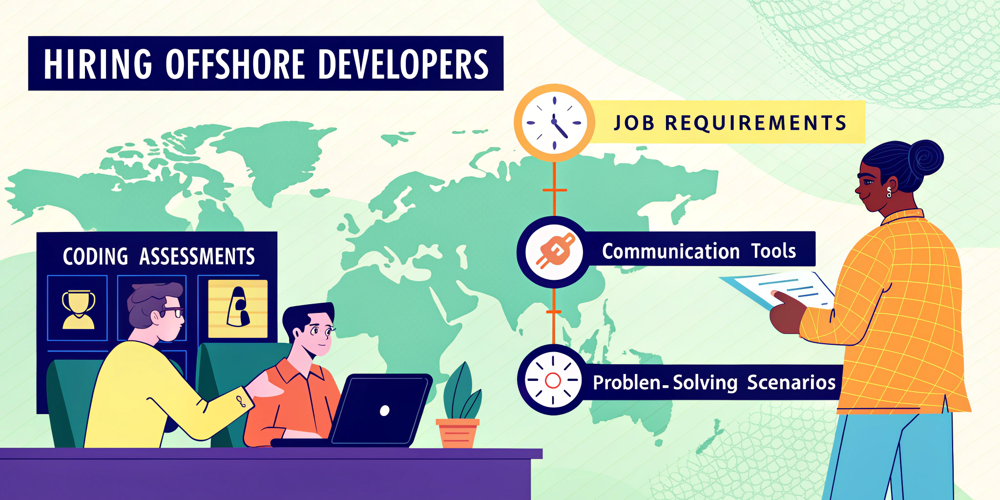

---
slug: interview-like-a-pro-7-tricks-to-hire-the-best-offshore-developers
title: "Interview Like a Pro: 7 Tricks to Hire the Best Offshore Developers"
description: Streamline your offshore developer hiring process with structured interviews, technical assessments, and effective communication checks.
keywords:
  [offshore developers, hiring tips, interview process, remote collaboration, technical assessments, communication skills, talent acquisition]
authors: [yaama]
tags: [offshore-developers, hiring-tips, interview, talent-acquisition]
--- 

import CTABanner from "@site/src/components/CTABanner";
import AudioPlayer from "@site/src/components/AudioPlayer";

# Interview Like a Pro: 7 Tricks to Hire the Best Offshore Developers

<AudioPlayer
  src="https://assets.yaama.tech/podcasts/interview-like-a-pro-7-tricks-to-hire-the-best-off.MP3"
  title="Listen to the deep dive conversation:"
/>

**Hiring offshore developers can be challenging, but following a structured process can help you find the right talent efficiently.** Here's how you can streamline the process and avoid common pitfalls:

-   **Define clear job requirements:** Specify technical skills, experience levels, and communication needs to attract the right candidates.
    
-   **Use a consistent interview framework:** Standardise questions to fairly evaluate technical proficiency, project experience, and remote collaboration skills.
    
-   **Test technical abilities:** Create project-specific assessments and use platforms with automated scoring and plagiarism detection.
    
-   **Assess communication skills:** Evaluate speaking, writing, and listening abilities, as well as remote collaboration tools and practices.
    
-   **Leverage remote interview tools:** Use video interviews and live coding sessions to assess real-time problem-solving and communication.
    
-   **Evaluate problem-solving skills:** Present realistic work scenarios and assess decision-making under pressure.
    
-   **Conduct thorough reference checks:** Verify technical capabilities, remote work success, and team collaboration through targeted questions.
    

**Quick Tip:** Focus on both technical skills and soft skills like communication and remote work capabilities to ensure a good fit for distributed teams. Implement these steps to improve the quality of your offshore hiring process and build a strong, reliable team.

<!-- truncate -->

<CTABanner
  title="Need Help Hiring Offshore Developers?"
  subtitle="Let our experts streamline your hiring process and connect you with top global talent."
  buttonText="Talk to an Expert"
/>

## 1\. Set Clear Job Requirements

Clear job requirements make offshore hiring more efficient by attracting candidates who align with your project needs.

### Write Detailed Job Descriptions

A well-crafted job description helps filter out unsuitable applicants and draws in candidates who meet your criteria. Focus on these essential components:

| Component | Description | Example Requirements |
| --- | --- | --- |
| **Technical Skills** | Core technologies and programming languages | - Python 3.x proficiency   - PostgreSQL database experience   - REST API development |
| **Experience Level** | Years of experience and project scope | - 5+ years in backend development   - Experience with microservices architecture   - Remote work history |
| **Communication** | Language and collaboration requirements | - Professional English proficiency   - Experience with async communication   - Documentation skills |

### Align Skills with Project Needs

To ensure your developers can meet your project goals, match their skills to your specific objectives. Determine whether they'll handle entire projects or focus on certain tasks.

Take these factors into account when aligning skills to your project:

-   Core technologies and frameworks your project uses
    
-   Specific tools and software expertise required
    
-   Performance expectations and quality benchmarks
    
-   Timezone overlap for collaboration
    
-   Familiarity with tools like [Slack](https://slack.com/intl/en-au) or [Jira](https://www.atlassian.com/software/jira)
    
-   Responsibilities for documentation
    
-   Team communication style and preferences
    
-   Preferred workflows and processes
    
-   Reporting structure and accountability measures
    

Defining these requirements provides a strong foundation for a consistent and efficient interview process.

## 2\. Build a Consistent Interview Framework

A well-structured interview framework helps ensure a fair and unbiased evaluation process for offshore candidates.

### Prepare Core Interview Questions

Using standardised questions allows for an objective assessment. Focus on these key areas:

| **Question Category** | **Focus Areas** | **Sample Questions** |
| --- | --- | --- |
| **Technical Proficiency** | Programming languages, system design | - Describe a challenging technical problem you solved recently.   - How would you improve the performance of a slow-running application? |
| **Project Experience** | Past work, problem-solving | - What was your role in your most complex project?   - How do you handle technical debt in your projects? |
| **Remote Collaboration** | Communication tools, async work | - Which remote collaboration tools have you used?   - How do you maintain clear documentation for team members? |

> "The important thing when interviewing developers is to make sure that there is a structure to the interview, however informal your company may be." - Jack Zmudzinski, Senior Associate at Future Processing

To maintain consistency, interviewers should:

-   Ask questions in the same order for every candidate.
    
-   Record their observations immediately after each interview.
    
-   Use open-ended questions to understand candidates' thought processes.
    

Once you've covered these basics, move on to evaluating their remote work skills.

### Test Remote Work Skills

Remote work capabilities are critical for offshore developers. Here's what to assess:

**Communication Tools**

Evaluate their experience with tools like:

-   Video conferencing platforms
    
-   Project management software
    
-   Version control systems
    
-   Team chat applications
    

**Remote Work Environment**

Understand their setup by discussing:

-   Home office equipment and setup
    
-   Internet connection reliability
    
-   Security practices
    
-   Time zone management strategies
    

> "If you want to successfully interview developers, make sure to always have an expert in the interview room. Technical skills are crucial to evaluate the latest development technologies." - Tatyana Tyagun, HR Generalist at Chanty

Key remote work skills include:

-   Clear communication across time zones
    
-   Proficiency with collaboration tools
    
-   Initiative in working independently
    
-   Effective documentation practices
    
-   Meeting deadlines without supervision
    

Other requirements to consider:

-   Familiarity with collaboration tools
    
-   Overlap in working hours
    
-   Agreed response time expectations
    

## 3\. Test Technical Skills

Technical assessments help identify developers who can write quality code and solve practical problems.

### Create Job-Specific Tests

To evaluate an offshore developer's capabilities effectively, craft tests that align with your project needs. These should simulate tasks they'll encounter in the role.

Here's what to include in your technical tests:

-   **Project-Based Challenges**: Tailor the tests to your tech stack and codebase. Examples:
    
    -   Debugging existing code
        
    -   Adding features to a sample application
        
    -   Improving performance in specific areas
        
    -   Writing unit tests for given code
        
-   **Time Constraints**: Keep tests manageable, ideally between 60–90 minutes.
    
-   **Documentation**: Require candidates to explain their code and reasoning. This shows their ability to communicate clearly and think critically.
    

Once your challenges are ready, use modern platforms to streamline the evaluation process.

### Leverage Testing Platforms

Testing platforms simplify the process with standardised environments and automated scoring.

| Feature | Why It Matters |
| --- | --- |
| Real-time Monitoring | Observe progress and identify any struggles |
| Automated Scoring | Quickly assess code quality and performance |
| Plagiarism Detection | Verify the originality of submitted work |
| Custom Test Creation | Build assessments tailored to your requirements |

These tools also provide detailed insights:

> "Coding tests provide valuable assessments of a developer's technical skills, problem-solving abilities, and coding proficiency." - Julia Biliawska, Technical Recruiter at DistantJob [\[2\]](https://distantjob.com/blog/coding-tests-developer-evaluation/)

When choosing a platform, keep these factors in mind:

-   **Assessment Options**: Look for live coding sessions, take-home assignments, support for multiple programming languages, and tools for automated code reviews.
    
-   **Integration**: Ensure compatibility with systems you already use, like Applicant Tracking Systems (ATS), version control platforms, and HR tools.
    
-   **Reporting**: Opt for platforms that offer in-depth skill reports, performance comparisons, and exportable data for team discussions.
    

> "The most realistic technical screening platform with zero whiteboards in sight." - DevSkiller [\[2\]](https://distantjob.com/blog/coding-tests-developer-evaluation/)

Pair technical tests with interviews and portfolio reviews for a well-rounded evaluation.

<CTABanner
  title="Struggling with Technical Assessments?"
  subtitle="Get a free consultation on building effective coding tests and interview frameworks."
  buttonText="Book a Free Consultation"
/>

## 4\. Check Communication Skills

Strong communication ties a distributed team together, going beyond just technical expertise and remote work abilities.

### Assess Language Skills

Evaluate candidates' language skills across key areas:

| Communication Area | What to Assess | How to Evaluate |
| --- | --- | --- |
| **Speaking** | Pronunciation, fluency, grammar | Video calls and technical discussions |
| **Writing** | Clarity, tone, accuracy | Written tests and email responses |
| **Listening** | Comprehension and following instructions | Audio tasks and detailed instructions |
| **Technical Communication** | Explaining complex concepts | Project walkthroughs and documentation reviews |

Using standardised tools can provide an objective measure of language proficiency.

> "Assessing an individual's communication and soft skills is paramount, as they can considerably impact organisational performance and collaboration." [\[1\]](https://www.yourteaminindia.com/blog/tips-to-interview-remote-software-developers)

Once you've assessed these skills, look at how well candidates apply them in team environments.

### Review Team Collaboration

Explore candidates' ability to collaborate by discussing specific scenarios, such as:

-   **Handling Critical Errors**: How they communicate urgent issues across different time zones.
    
-   **Explaining to Non-Experts**: Ask them to describe a technical challenge to non-technical stakeholders.
    
-   **Resolving Conflicts**: Have them share how they managed team disagreements.
    

When reviewing their answers, focus on their communication methods, real-life examples, documentation habits, familiarity with collaboration tools, and strategies for navigating cultural differences. These insights can reveal how effectively they work in a team.

## 5\. Master Remote Interview Tools

With today's technology, remote interviews can be just as effective as meeting candidates in person. Using the right tools and techniques ensures a smooth process and helps you evaluate candidates thoroughly.

### Run Video Interviews

Video interviews work best when you use platforms that offer essential features:

| Feature | Purpose | Impact on Interview |
| --- | --- | --- |
| High-quality audio/video | Clear communication | Minimises misunderstandings |
| Screen sharing | Code review | Supports technical discussions |
| Recording capabilities | Documentation | Aids in decision-making |
| Secure meeting rooms | Confidentiality | Protects sensitive information |

To ensure a professional experience, keep these tips in mind:

-   Test your audio, camera, and lighting at least 10 minutes before the interview.
    
-   Use a stable internet connection and a clutter-free, professional background.
    
-   Enable screen sharing and recording for easy review after the session.
    
-   Always have a backup communication method ready, like a phone number or alternative platform.
    

Once the video interview is done, live coding sessions can help you assess real-time problem-solving skills.

### Use Live Coding Sessions

Live coding sessions are a great way to see how candidates think and work under pressure. Here's a sample structure:

| Phase | Duration | Focus |
| --- | --- | --- |
| Introduction | 5 minutes | Set expectations |
| Problem-solving | 30 minutes | Observe coding approach |
| Code review | 15 minutes | Discuss solutions |
| Q&A | 10 minutes | Address questions |

> "HackerRank allows us to interact with our candidates as naturally as possible to assess their skills and see how they collaborate with engineers in our organisation." – Naveed Zahid, Director, Engineering Transformation, Manulife [\[3\]](https://www.hackerrank.com/products/developer-skills-platform/interview/)

When conducting these sessions, consider the following:

-   **Pick the Right Tools**: Use platforms that support real-time code collaboration and test execution.
    
-   **Set Clear Expectations**: Define time limits and evaluation criteria upfront, so candidates know what to expect.
    
-   **Focus on Problem-Solving**: Pay attention to how candidates:
    
    -   Break down complex problems
        
    -   Handle edge cases
        
    -   Improve their solutions
        
    -   Respond to feedback
        

> "CoderPad standardised and streamlined our interview and hiring process. We've been able to provide a much better candidate experience and feel confident we're assessing the most important technical skills." [\[4\]](https://coderpad.io/)

The effectiveness of these tools is evident in HackerRank's Developer Love Index score of 4.72, based on feedback from over 200,000 developers.

## 6\. Test Problem-Solving

Evaluate candidates' ability to solve problems by observing how they handle challenges and make decisions under pressure.

### Present Work Scenarios

Design realistic scenarios to assess problem-solving skills. Use the following framework to structure these scenarios:

| **Scenario Type** | **Focus Area** | **Example Challenge** |
| --- | --- | --- |
| Code Optimisation | Performance | Reduce response time from 3 seconds to under 500 ms |
| System Architecture | Scalability | Create a solution for handling 10,000 concurrent users |
| Bug Resolution | Debugging | Fix memory leaks in production code |
| Integration | API Design | Connect legacy systems to modern microservices |

When presenting these scenarios, pay attention to:

-   **Context**: Use real challenges your team has faced to make the scenarios relatable.
    
-   **Constraints**: Include realistic deadlines, budgets, or technical limitations to simulate actual work conditions.
    
-   **Teamwork**: Add collaborative elements to assess communication and teamwork skills.
    

For technical evaluations, collaborative tools are key. Use platforms that allow real-time collaboration, such as virtual whiteboards for system design tasks. These tools let candidates sketch their solutions while explaining their thought process, giving you insight into how they approach problems.

These scenarios naturally lead into assessing how candidates make decisions under pressure.

### Check Decision-Making

Assess candidates' judgment by focusing on their approach to complex decisions. Base your evaluation on these critical areas:

| **Decision Area** | **Assessment Method** | **Key Indicators** |
| --- | --- | --- |
| Technical Choices | System design discussion | Technology selection, architecture decisions |
| Risk Management | Scenario analysis | Identifying risks, proposing mitigation plans |
| Resource Allocation | Project planning | Time management, prioritisation |
| Team Collaboration | Role-play exercises | Communication style, conflict resolution |

These assessments reveal how candidates handle complex scenarios. While technical tests gauge coding skills, decision-making evaluations highlight their ability to think strategically.

Focus your evaluation on:

-   **Approach**: How they break down and analyse complex challenges.
    
-   **Trade-offs**: Their ability to weigh competing priorities effectively.
    
-   **Clarity**: How well they document and explain their decisions.
    
-   **Continuous Learning**: Their strategies for staying current in their field.
    

For senior-level roles, include system design interviews that emphasise scalability, storage, and reliability to assess their ability to think at a higher level.

## 7\. Check References

After assessing technical expertise, communication skills, and problem-solving abilities, checking references provides that final layer of confirmation.

When hiring remotely, reference checks become even more important. While interviews and tests reveal a candidate's abilities, references confirm how those skills translate into actual work performance.

### Ask the Right Questions

Focus your reference checks on areas that matter most for offshore roles:

| Assessment Area | Key Questions | What to Listen For |
| --- | --- | --- |
| Technical Capability | "How does this candidate compare to the best developers you've worked with?" | Concrete examples of achievements, ideally rated on a scale (e.g., 1–100). |
| Remote Work Success | "How effectively did they manage deadlines and communication in a remote setting?" | Evidence of clear communication and solid time-management skills. |
| Problem Resolution | "Can you describe a project that would have failed without their contribution?" | Stories that highlight initiative, creativity, and accountability. |
| Team Collaboration | "How did they handle differences of opinion in the team?" | Examples of resolving conflicts and working with diverse groups. |
| Reliability | "Were there instances when they missed deadlines? How did they handle it?" | Insights into how they communicate during challenges and their dependability. |

Gather specific examples instead of vague opinions. For offshore roles, it's especially important to ask about work style and cultural fit.

### Tips for Effective Reference Checks

1.  **Provide Context**: Share details about your work environment and ask how the candidate might perform in it.
    
2.  **Understand Support Needs**: Ask, "What kind of support helps this candidate excel?"
    
3.  **Speak to Multiple Sources**: Aim for 2–3 professional references for a well-rounded view.
    

> "When in doubt, when we feel a little hesitant, but the references say that this person was really strong in that particular skill, I trust the reference" [\[5\]](https://review.firstround.com/25-questions-for-reference-calls/).

> "There's nothing more unfair than to treat everyone the same" [\[5\]](https://review.firstround.com/25-questions-for-reference-calls/).

> "A robust reference check is essential to understand the background and experience of a person we are hiring" [\[6\]](https://www.xref.com/blog/how-great-reference-checking-leads-to-great-hiring-decisions).

> "I'm really listening for how enthusiastic or passionate they are when they talk about the candidate. There are some people on my team that I can't wait for the day I get to give a reference for and talk about how amazing they are for 30 minutes" [\[5\]](https://review.firstround.com/25-questions-for-reference-calls/).

## Conclusion: Next Steps

To successfully hire offshore developers, focus on a mix of technical evaluations, communication assessments, and thorough reference checks.

Key strategies include:

-   **Defining Clear Requirements**
    
-   **Establishing a Structured Framework**
    
-   **Conducting Technical Assessments**
    
-   **Evaluating Communication Skills**
    
-   **Ensuring Proficiency with Remote Tools**
    
-   **Assessing Problem-Solving Abilities**
    
-   **Performing Reference Checks**
    

These steps provide a solid foundation for improving your hiring process.

Take it further by documenting your interview process and implementing a scorecard system to evaluate candidates. This ensures fair comparisons and supports hiring decisions based on data rather than instinct.

<CTABanner
  title="Ready to Build Your Offshore Team?"
  subtitle="Connect with our team to get started."
  buttonText="Connect"
/>