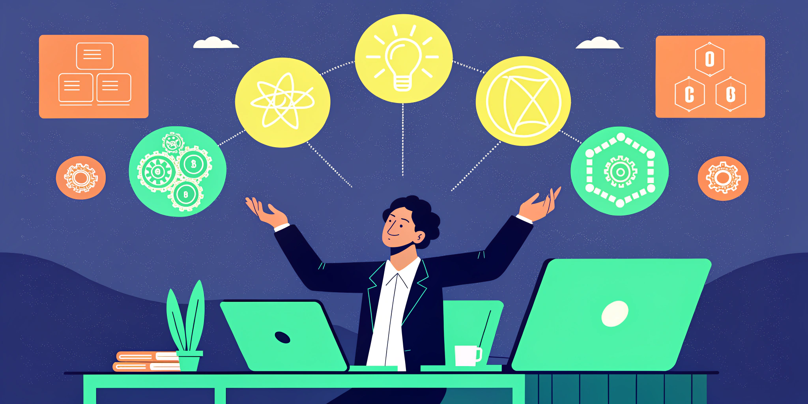

import CTABanner from "@site/src/components/CTABanner";
import AudioPlayer from "@site/src/components/AudioPlayer";

# The Great AI Model Shuffle: Why Developers Are Wasting 6 Hours a Week (And How to Get Them Back)

<AudioPlayer
  src="https://assets.yaama.tech/podcasts/great-ai-model-shuffle-developers-wasting-6-hours-week.mp3"
  title="Listen to the deep dive conversation:"
/>

# The Great AI Model Shuffle: Why Developers Are Wasting 6 Hours a Week (And How to Get Them Back)

**SHOCKING: The average developer wastes 312 hours annually just switching between AI models. That's nearly 8 full work weeks down the drain.**

What if I told you the AI revolution that promised to boost productivity is actually creating a massive new inefficiency? The evidence is mounting, and it's time we addressed the elephant in the developer room.

<!-- truncate --> 

## The Hidden Productivity Killer No One's Talking About

Every day, developers worldwide perform an exhausting dance I call "The Great AI Model Shuffle" — bouncing between ChatGPT, Claude, Gemini, Llama, and countless specialized models. Each switch costs precious time, focus, and mental energy.

> "I spend more time configuring different AI environments than actually solving problems with them," confessed a senior developer at a Fortune 500 company during my recent consultation.

This resonated deeply. In my work with engineering teams across industries, I've witnessed brilliant minds reduced to glorified system administrators — constantly juggling credentials, environments, and incompatible outputs.

But here's the kicker: according to Stanford's 2025 AI Index Report, context switching between tools reduces deep work capacity by up to 40%. That's not just inefficiency. That's talent waste at industrial scale.

**BOOM.**

## The Three-Headed Monster Devouring Developer Time

The problem is three-fold:

* **Fragmented tooling** forces developers to become "AI polyglots" just to complete basic tasks.
* **Poor integration** between models creates manual handoffs that should be automated.
* **Constant new models** introduce perpetual learning curves that steal focus from actual innovation.

A mid-sized development team of 20 engineers is losing approximately 6,240 hours annually to this shuffle. That's equivalent to THREE FULL-TIME DEVELOPERS worth of productivity.

*Gone. Vanished. Evaporated.*

## The Real Cost Goes Beyond Hours

The financial impact is staggering. With the average developer salary hovering around $120,000 in 2025, companies are burning roughly $360,000 per year in lost productivity for every 20 developers on staff.

But the cost isn't just financial — it's emotional too.

> "The constant context switching between different AI environments is mentally exhausting," shares Maya Chen, Lead Engineer at a prominent fintech startup. "By Friday afternoon, I feel like my brain has run a marathon just from reformulating the same problems for different AI models."

*Sound familiar?*

## Why This Is Happening Now

The explosion of specialized AI models has created what researchers call "tool fragmentation" — a phenomenon where each new capability comes packaged in its own isolated environment.

While Gemini 2.5 might excel at visual reasoning tasks, Claude Opus might handle long-context documentation better, and your company's custom-tuned model might understand internal codebases more effectively.

Each has its strengths. Each has its interface. Each has its quirks.

And you're left playing AI traffic controller instead of building great software.

## The Four Strategies Smart Teams Are Using

The most effective engineering organizations I've worked with are reclaiming those lost hours through four proven strategies:

1.  **Unified AI Platforms**
    Forward-thinking teams are implementing platforms that support multiple models through a single interface. This approach has shown to reduce context-switching time by up to 73%, according to a 2025 developer productivity study by DevOps Research and Assessment (DORA).
2.  **Knowledge Consolidation**
    Creating internal knowledge bases that document model-specific quirks and best practices prevents every team member from rediscovering the same limitations.
3.  **AI Office Hours**
    Establishing regular sessions where developers share optimization techniques creates a culture of continuous improvement around AI usage.
4.  **Custom Middleware**
    Building lightweight translation layers between different AI services eliminates manual copy-pasting and reformatting.

## 5 Practical Steps You Can Implement Today

Ready to reclaim your six hours? Here's your action plan:

1.  **Conduct an AI audit** — Track which models you use and why for one week.
2.  **Identify your core models** — Find the 2-3 tools that cover 90% of your needs.
3.  **Create decision rules** — Establish clear guidelines for when to use each model.
4.  **Implement unified interfaces** — Explore tools like LangChain or Fixie that provide single-point access.
5.  **Schedule optimization reviews** — Set aside 15 minutes weekly to refine your AI workflow.

**Screenshot this list. Your future self will thank you.**

## The Teams That Solve This First Will Win

Imagine what your developers could build with an extra 300+ hours per year.

That's not just optimization. That's transformation.

The teams that solve this integration challenge first will have a massive competitive advantage in shipping features, attracting talent, and maintaining developer satisfaction.

As AI continues to evolve at breakneck speed, the winners won't be those with access to the most models — but those who integrate them most seamlessly.

## What's Your Experience?

Have you felt the pain of the Great AI Model Shuffle? Which strategy resonates most with your situation?

Tag a colleague who needs to see this, and share your best tip for managing multiple AI models in the comments.

Let's build a collection of solutions together. After all, we're all navigating this new landscape together.

Forward this to the one developer on your team who's always juggling between AI tools — they'll appreciate knowing they're not alone.