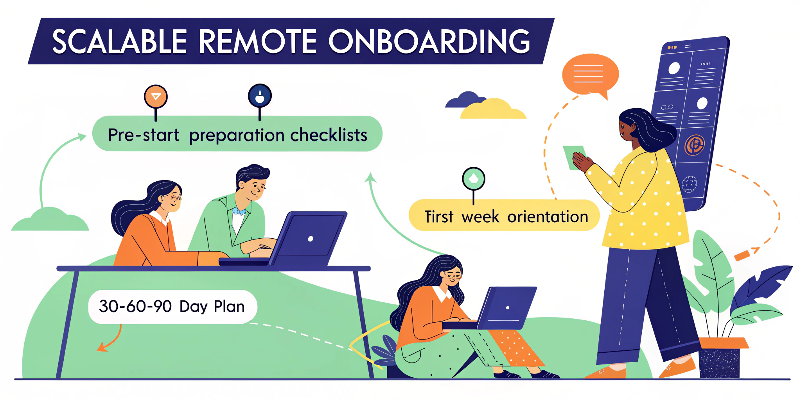

import CTABanner from "@site/src/components/CTABanner";
import AudioPlayer from "@site/src/components/AudioPlayer";
import FAQ from "@site/src/components/FAQ";

# How to Build a Scalable Remote Onboarding Process

<AudioPlayer
  src="https://assets.yaama.tech/podcasts/how-to-build-a-scalable-remote-onboarding-process.MP3"
  title="Listen to the deep dive conversation:"
/>

Remote onboarding is critical as more workplaces shift to remote work. Here's what you need to know to create a scalable process that boosts productivity and retention:

-   **Why It Matters**: 22% of the workforce will work remotely by 2025, and poor onboarding leads 20% of new hires to leave within 45 days. A structured process can improve productivity by 70% and retention by 82%.
-   **Key Components**:
    -   **Automation**: Streamline repetitive tasks like document management and compliance tracking.
    -   **Self-Service Resources**: Provide a central knowledge base, technical guides, and role-specific materials.
    -   **Standardised Templates**: Use checklists, milestone trackers, and communication templates for consistency.
-   **4 Stages of Onboarding**:
    1.  **Pre-Start**: Prepare equipment, software access, and welcome materials before day one.
    2.  **Week 1**: Focus on orientation, team introductions, and early check-ins.
    3.  **30-60-90 Day Plan**: Gradually transition hires from learning to independent contributions.
    4.  **Continuous Feedback**: Regularly gather feedback and refine the process.
-   **Tools to Use**: Platforms like [BambooHR](https://www.bamboohr.com/) (AU$6.19/user/month) and [Gusto](https://gusto.com/) (AU$49/month + AU$6/user) automate workflows, while communication tools like [Microsoft Teams](https://www.microsoft.com/en-au/microsoft-teams/collaboration) and [Guru](https://www.getguru.com/) improve collaboration and access to information.
-   **Measure Success**: Track metrics like time-to-productivity, retention rates, and new hire satisfaction to evaluate and improve the process.

A scalable onboarding process combines automation, clear resources, and regular feedback to ensure remote hires feel connected and productive from day one.

<!-- truncate --> 

## Core Components of Scalable Remote Onboarding

Creating a scalable remote onboarding process depends on three essential components. Organisations that adopt these elements report impressive results: a 30% reduction in the time spent on onboarding paperwork and an 87% faster path to productivity for new hires [\[2\]](https://www.flowforma.com/blog/onboarding-automation).

### Process Automation

Automation takes the tedious manual work out of onboarding, making it more efficient and consistent. Organisations that implement automation in their onboarding processes have seen a 50% boost in compliance accuracy [\[2\]](https://www.flowforma.com/blog/onboarding-automation). Here's a breakdown of how automation can transform key areas:

| **Process Area** | **Benefits** | **Impact** |
| --- | --- | --- |
| Document Management | Automated distribution and tracking | 30% reduction in paperwork time [\[2\]](https://www.flowforma.com/blog/onboarding-automation) |
| Account Provisioning | Instant access to necessary tools | Streamlined app provisioning |
| Compliance Tracking | Automated verification and reminders | 50% improvement in compliance accuracy [\[2\]](https://www.flowforma.com/blog/onboarding-automation) |
| Progress Monitoring | Real-time tracking and analytics | Enhanced oversight and timely action |

Once automation is in place, the next step is to provide self-service resources for new hires.

### Self-Service Documentation

Self-service documentation empowers new employees to take control of their onboarding journey while maintaining consistency across the board. [GitLab](https://about.gitlab.com/solutions/devops-platform/)'s self-service onboarding model is a prime example of how this approach can work effectively.

> "There is no amount of sugar-coating or shortcut-taking that can cover the tremendous benefit enjoyed by shifting as much of your onboarding as possible to a self-serve mechanism. This creates a more inclusive experience, enabling people to onboard, explore, digest, ponder, and propose updates on a schedule that best suits them." - Darren Murph, global head of remote at GitLab [\[3\]](https://remote.com/blog/onboarding-remote-employees-tips)

Some key features of an effective self-service system include:

-   **Central knowledge base:** A centralised hub with information on company policies, procedures, and workplace culture.
-   **Technical setup guides:** Step-by-step instructions to help new hires configure their workstations and access the required tools.
-   **Role-specific resources:** Tailored learning paths that cater to the unique needs of specific roles and departments.
-   **Interactive training modules:** Self-paced materials that include progress tracking to keep employees on course.

### Standard Process Templates

With turnover rates as high as 37% within the first 90 days [\[6\]](https://remote.com/blog/remote-employee-onboard-checklist), standardised templates are crucial for delivering a consistent and effective onboarding experience. These templates build on automated processes and self-service tools to ensure every new hire receives the same level of support and preparation.

> "Onboarding is a magic moment when new employees decide to stay engaged or become disengaged." - Amy Hirsh Robinson, principal of The Interchange Group [\[4\]](https://www.getguru.com/he/reference/employee-onboarding-process)

The benefits of standardisation are clear. Organisations with structured onboarding processes report that employees are 30 times more likely to experience high job satisfaction [\[1\]](https://www.workato.com/the-connector/onboarding-automation-guide). Yet, only 12% of workers believe their organisation has a solid onboarding process [\[5\]](https://www.indeed.com/hire/c/info/16-steps-to-effective-virtual-onboarding-with-checklist-and-sample-schedule), showing there's a lot of room for improvement.

Key elements of effective templates include:

-   **Role-specific checklists:** These ensure core standards are met while allowing for role-specific needs.
-   **Milestone tracking frameworks:** Tools to monitor progress and maintain consistency throughout the onboarding journey.
-   **Communication templates:** Pre-prepared messages for key moments in the onboarding process.
-   **Feedback mechanisms:** Systems to gather input from new hires and refine the process over time.

Building on the foundation of automation and streamlined processes, the next step in creating a strong remote onboarding experience is defining clear stages.

## 4 Stages of Remote Onboarding

A well-structured remote onboarding process can increase retention by 82% and improve productivity by more than 70% [\[11\]](https://asana.com/resources/30-60-90-day-plan).

### Pre-Start Preparation

Onboarding starts well before the new hire's first day, setting the stage for a smooth transition. Key pre-start tasks include:

| **Timeline** | **Action Items** | **Purpose** |
| --- | --- | --- |
| 2 weeks before | Order and set up equipment | Ensure timely delivery |
| 1 week before | Provide software access | Enable productivity on day one |
| 3–5 days before | Send a welcome package | Make a positive first impression |
| 1–2 days before | Schedule first-week meetings | Plan a structured introduction |

> "Onboarding begins before day one. Make sure your new hires have everything they need before their official start date." [\[7\]](https://www.waybook.com/blog/remote-employee-onboarding-essentials-checklist-advice)

GitLab's onboarding process highlights the importance of early preparation, ensuring system access and tools are in place before the new hire starts [\[7\]](https://www.waybook.com/blog/remote-employee-onboarding-essentials-checklist-advice).

### Week 1 Checklist

The first week is all about building momentum and helping new hires feel confident in their role. Here's how to structure it:

-   **Day One Essentials**  
    Kick off with a detailed orientation covering company policies, benefits, and essential training. Arrange introductory calls with team members and assign a mentor to guide them.
    
-   **Mid-Week Check-in**  
    By Wednesday, review progress to address any early challenges and confirm all systems are functioning properly.
    
-   **End-of-Week Integration**  
    Schedule one-on-one meetings with key stakeholders across different time zones to build relationships and clarify workflows.
    

### 30-60-90 Day Plan

With 25% of employees leaving within the first 45 days [\[9\]](https://www.virtuallatinos.com/blog/30-60-90-day-plan), a structured 30-60-90 day plan is crucial for long-term success:

| **Timeline** | **Focus Areas** | **Key Objectives** |
| --- | --- | --- |
| First 30 Days | Adaptation | Learn company values, policies, and role basics |
| Days 31–60 | Integration | Strengthen team collaboration, tackle complex projects, and grow skills |
| Days 61–90 | Autonomy | Take on leadership tasks, contribute to cross-team projects, and plan career goals |

> "Painting done means not just assigning a task, but explaining the reason - clarifying how the end product will be used. Providing colour and context - the purpose, not just the mechanics. Sharing the reason for a task helps uncover stealth expectations and stealth intentions, cultivates commitment and contribution, and facilitates growth and learning." – Brené Brown [\[8\]](https://www.holloway.com/g/remote-work/sections/30-60-90-day-goals)

Set SMART goals [\[10\]](https://www.indeed.com/career-advice/starting-new-job/30-60-90-day-plan) and conduct regular check-ins at each milestone. This approach ensures alignment and supports the transition to independent work in a remote setting [\[8\]](https://www.holloway.com/g/remote-work/sections/30-60-90-day-goals).

## Tools for Remote Onboarding

Having a structured process is important, but the right digital tools can make remote onboarding smoother and more efficient. With predictions showing that 73% of teams will work remotely at least half the time by 2028 [\[15\]](https://fasthire.io/10-essential-tools-to-streamline-your-remote-onboarding-process-in-2025), investing in the right tools is a must to scale your onboarding process effectively.

### Task Automation Systems

Onboarding software helps minimise manual work while maintaining compliance and engagement. Here are some key features to consider:

| Feature | Purpose | Impact |
| --- | --- | --- |
| Workflow Automation | Automates repetitive tasks and approvals | Saves time and effort |
| Digital Document Management | Enables paperless onboarding for quicker engagement | Increases efficiency |
| Progress Tracking | Tracks onboarding milestones | Ensures compliance |

For example, platforms like **BambooHR** (starting at AU$6.19 per user/month) and **Gusto** (AU$49 per month plus AU$6 per user/month) provide robust automation features that grow with your team [\[13\]](https://peoplemanagingpeople.com/tools/best-hr-software-for-onboarding).

### Team Communication Tools

Communication is often one of the biggest challenges for remote teams, with 41% of remote employees citing it as their main hurdle [\[16\]](https://pebb.io/articles/7-ways-to-boost-remote-team-communication-in-2025). Here's how the right tools can help:

-   **Synchronous Communication**: Real-time collaboration is made easier with tools like Microsoft Teams, which now includes VOIP, PBX, and video calling functionalities [\[14\]](https://www.digitalocean.com/resources/articles/remote-work-tools).
-   **Knowledge Management**: Platforms like **Guru** (AU$10 per user/month) allow you to create searchable documentation libraries, giving team members easy access to information [\[13\]](https://peoplemanagingpeople.com/tools/best-hr-software-for-onboarding).
-   **Project Management**: Integrated tools that combine task management with communication ensure clear accountability and help track progress.

By combining automation with effective communication platforms, organisations can create a seamless onboarding experience. For teams expanding globally, specialised tools can further enhance these capabilities.

### [Yaama Tech](https://yaama.tech/)'s Remote Team Solutions

**Yaama Tech** offers tailored solutions for onboarding remote teams efficiently [\[18\]](https://preview.yaama.tech/remote-staffing):

-   **Seamless Integration**: New employees are instantly connected with established communication channels and performance monitoring systems.
-   **Flexible Engagement**: No long-term commitments, plus the option for quick replacements if needed.
-   **Technical Infrastructure**: Cloud-based tools ensure secure and productive remote collaboration.

> "Leadership is not about being in charge. It is about taking care of those in your charge." - Simon Sinek [\[17\]](https://hyperspace.mv/remote-communication)

Organisations that prioritise open communication see an 18% boost in productivity and are 4.5 times more likely to retain top talent [\[16\]](https://pebb.io/articles/7-ways-to-boost-remote-team-communication-in-2025).

###### sbb-itb-50da8c8

## Tracking Onboarding Success

Consistently tracking and evaluating onboarding efforts can significantly improve outcomes. For instance, structured onboarding programs have been shown to boost employee retention by 82% and increase productivity by over 70% [\[19\]](https://www.techfunnel.com/hr-tech/roi-effective-onboarding-success-impact).

### Key Success Metrics

To measure onboarding success, focus on a combination of productivity, engagement, retention, and training metrics. Here's a quick breakdown:

| Metric Category | Metrics | Target Outcomes |
| --- | --- | --- |
| Productivity | Time to first achievement, completion rates | 30-60-90 day goals met |
| Engagement | eNPS, survey participation | \>80% participation rate |
| Retention | First-year retention rate | \>70% retention |
| Training | Completion rates, compliance | 100% completion |

Replacing a high-performing employee can cost up to twice their annual salary [\[20\]](https://trainingindustry.com/articles/onboarding/is-your-onboarding-working-6-key-metrics-to-measure-effectiveness). This makes it essential to track both quantitative and qualitative measures to ensure onboarding programs are effective.

**Quantitative Metrics** include:

-   Time it takes for new hires to reach full productivity
-   Completion rates for training modules
-   Retention rates during the first year
-   Employee Net Promoter Score (eNPS)

**Qualitative Insights** might involve:

-   Feedback from managers on how well new hires integrate into their teams
-   Peer evaluations of how well new employees fit within the workplace culture
-   Satisfaction surveys from new hires about their onboarding experience

By combining these metrics, you can pinpoint areas for improvement and refine your onboarding process.

### Process Improvement Cycle

The secret to effective onboarding is continuous improvement. Feedback gathered from metrics should directly inform adjustments to the process. For example, [PatientPop](https://get.patientpop.com/) revamped their virtual onboarding approach after new hire feedback revealed that IT setup should occur on day one instead of after executive meetings [\[22\]](https://www.builtinla.com/articles/remote-onboarding-strategies).

> "The key is to approach onboarding from the learner's perspective. If we can accomplish the objectives that are most important to learners, the organisational priorities - compliance, time to competency, time to productivity, retention rates, etc. - will also be achieved."
> 
> -   Blake Beus, Vice President of Sales and Business Development, [AllenComm](https://www.allencomm.com/) [\[21\]](https://trainingindustry.com/articles/onboarding/the-experience-gap-analysis-a-fresh-approach-to-assessing-onboarding-training-needs)

A solid improvement cycle might look like this:

1.  **Regular Check-ins**  
    Schedule feedback sessions at critical milestones:
    
    -   **Day 7**: Gather insights on the initial experience.
    -   **Day 30**: Assess role clarity and understanding.
    -   **Day 90**: Evaluate overall integration and alignment.
2.  **Data Analysis**  
    Review trends to uncover recurring issues, successful practices, and areas where resources or training might need adjustment.
    
3.  **Action Planning**  
    Use the feedback to make tangible updates:
    
    -   Revise onboarding documentation to address frequently asked questions.
    -   Improve training modules for better clarity and engagement.
    -   Adjust timelines to better align with new hire needs.
    -   Strengthen communication channels to ensure smoother onboarding.

Recent findings from [Brandon Hall Group](https://brandonhall.com/) highlight that 31% of employees rate their onboarding experience as unsatisfactory, yet 41% of organisations are actively working to improve their programs [\[21\]](https://trainingindustry.com/articles/onboarding/the-experience-gap-analysis-a-fresh-approach-to-assessing-onboarding-training-needs).

Blending automated feedback tools with regular one-on-one check-ins allows you to gather a full picture of new hire experiences while maintaining a personal touch. This dual approach ensures that onboarding not only meets organisational goals but also supports employee satisfaction and success.

## Conclusion: Next Steps for Scaling

Creating a scalable remote onboarding process requires a mix of automation, thorough documentation, and continual fine-tuning. When done right, effective onboarding has the potential to drive revenue growth by as much as 2.5× [\[24\]](https://peoplemanagingpeople.com/employee-lifecycle/onboarding/how-to-onboard-remote-employees).

Here's how you can start building a system that works:

### **Automate Key Processes**

Start by identifying repetitive, time-consuming tasks and automate them. Kim Behnke, a former Senior Executive HR Administrator, highlights the impact of automation:  
_"As the main HR contact for onboarding, no one would know how to handle it if I was away. Automating key parts of the process really helped to smooth this out. Once a candidate signed their employment contract, a series of automated workflows would notify key stakeholders of all their required tasks, meaning nothing fell through the cracks due to manual processes."_ [\[23\]](https://peoplemanagingpeople.com/employee-lifecycle/onboarding/automate-onboarding)

Automation ensures that important steps are not missed, even when manual oversight isn't possible.

### **Standardise Documentation**

Develop detailed, role-specific workflows and training materials to create a consistent onboarding experience. Platforms like Yaama Tech offer tools that help streamline documentation, making it easier to scale remote teams effectively.

### **Measure and Improve**

Keep track of onboarding metrics to identify bottlenecks and areas for improvement. For example, businesses that collaborate with professional employment organisations report saving 27.3% on HR administration costs [\[12\]](https://www.justworks.com/blog/remote-onboarding-best-practices-for-dispersed-teams). Regularly reviewing these metrics ensures your process evolves as your team grows.

To take your onboarding transformation to the next level, consider these additional steps:

-   **Map Out Detailed Workflows**  
    Design workflows tailored to each role, highlighting key touchpoints and assigning responsibilities. This approach not only creates consistency but also allows for personalised onboarding experiences that cater to different positions.
    
-   **Invest in the Right Tools**  
    Use integrated platforms for automation, documentation, and communication. Incorporate regular check-ins and feedback loops. For instance, Microsoft's buddy program showed that new hires paired with a buddy experienced 23% higher satisfaction rates after their first week [\[24\]](https://peoplemanagingpeople.com/employee-lifecycle/onboarding/how-to-onboard-remote-employees).
    

Scaling remote onboarding successfully is about finding the right balance between automation and meaningful human interaction. By using the right tools and maintaining open communication, organisations can create an onboarding process that not only grows with the team but also keeps employees engaged and productive.

## FAQs

<FAQ question="How does automation improve the remote onboarding process for growing teams?">
Automation has become a game-changer in making remote onboarding smoother and more efficient - especially as teams continue to grow. By taking over repetitive tasks like form-filling, task assignments, and progress tracking, automation saves valuable time, reduces mistakes, and ensures every new hire has a consistent experience.

With automated systems, digital paperwork is handled with ease, self-service portals empower new employees to access what they need, and every step of the onboarding process stays on schedule. This not only simplifies operations but also helps new team members feel welcomed and supported, boosting their engagement and satisfaction. As a result, businesses can create an onboarding process that's not only efficient but also scalable, growing effortlessly alongside their remote teams.
</FAQ>

<FAQ question="What are the best ways to collect and act on feedback from new hires during remote onboarding?">
Gathering input from new hires and taking action on it is a key step in improving your remote onboarding process. Start by setting up <strong>one-on-one check-ins</strong> throughout the onboarding phase. These conversations offer a comfortable setting for new employees to discuss their experiences, share any challenges, and provide suggestions. Plus, it shows them that their voice matters.

You can also implement <strong>structured surveys</strong> at specific milestones, such as the end of the first week and the first month. These surveys can give you measurable insights into their onboarding journey and help uncover patterns or recurring issues. By combining individual feedback with survey data, you can strike a balance that leads to meaningful changes. This kind of feedback process not only improves onboarding but also boosts employee engagement and retention in the long run.
</FAQ>

<FAQ question="How do standardised templates improve remote onboarding for growing teams?">
Standardised templates are a game-changer when it comes to building a smooth and consistent remote onboarding process. They provide a clear framework, ensuring every new team member gets the same crucial information right from the start. This helps them quickly grasp their role and responsibilities, setting the stage for a confident beginning.

For HR teams and managers, templates are a huge time-saver. By simplifying repetitive tasks and cutting down on manual work, they not only save effort but also reduce the chances of errors. At the same time, these templates can be tailored to suit specific requirements, striking a balance between consistency and adaptability.

Another big advantage? They make onboarding multiple employees at once much more manageable. As your remote team expands, templates ensure the process remains scalable, leading to smoother transitions, more positive employee experiences, and faster integration into the team.
</FAQ>